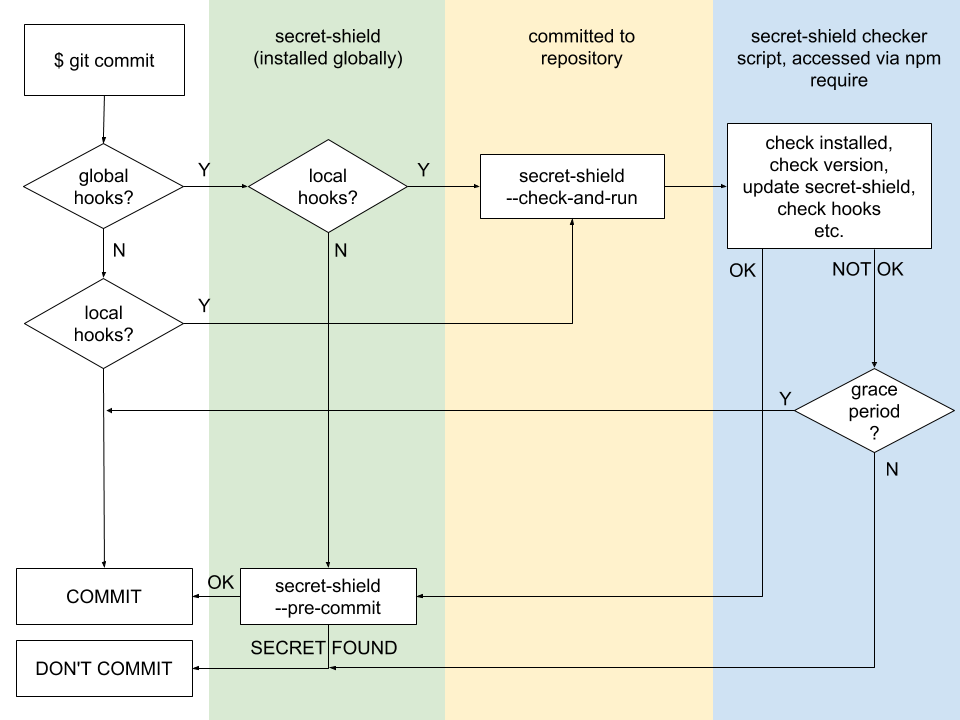

# Becoming a  repository

By simply adding one command to your repository's hooks manager as a pre-commit hook, secret-shield will automatically protect not only your repository, but every repository present in every computer that commits to your repository. This way, by partnering only with a few repositories, a team or organization can get secret-shield installed on most of their computers.

This is meant to be as a set-it-and-forget-it. You will not need to commit or maintain any code in your repository, apart from the command in your hooks.

## How to install in your repository

1. Add secret-shield to your hooks manager (e.g. husky) alongside your other hooks: `secret-shield --check-and-run 2018-08-01 && myOtherHooks`, setting the date to your [desired grace period](#what-is-the-grace-period).
4. Install secret-shield as an npm dependency in `package.json`. This is only needed for the command above and is not the actual secret-shield that will be run.
5. Add the cool badge to your repository! Simply put `` at the top of your readme.

## FAQ

### How do I get help?

As a first step, check the secret-shield documentation and the [issue queue](https://github.com/mapbox/secret-shield/issues). Feel free to submit a ticket.

If you really need to commit something now and are having errors, running `git commit` with the `--no-verify` flag will force the commit through.

### What is the grace period?

In order to encourage people to have secret-shield installed, there will be a grace period where users who don't have secret-shield installed globally will be warned whenever they commit to your repository. After the grace period, people who don't have secret-shield will be unable to commit to your repository. You have full control of this grace period by changing your repository's `secret-shield-checker.js` to call `secretShield.checkAndRun()` with the desired end date, e.g. `secretShield.checkAndRun('2018-07-01')`. It's highly encouraged you provide a grace period: if you don't, committing will stop working immediately for people without secret-shield.

### What if I don't have a hooks manager?

You'll need to install one to your repository; a popular option is [husky](https://github.com/typicode/husky).

## How it works

### Repository integration

The wrapper command will run a secret-shield checker that checks whether secret-shield is installed globally, and whether it's configured as a global pre-commit hook. If it's not, then it will give the user a grace period to resolve the issue, after which it will block commits to your repository. The checker can automatically resolve many of the issues, such as installing secret-shield globally, updating it to the latest version, repairing some common hooks misconfigurations, etc.

The mechanism was designed so that, in case of a critical issue with secret-shield, the maintainers can push a patch to secret-shield without requiring intervention on your team's part to update your configuration or change files in your repository.

#### Technical details

Because we want to minimize the amount of code and logic committed to your repository, secret-shield works in a somewhat roundabout fasion. Take a look at the flowchart below to see what happens when someone runs `git commit`.

